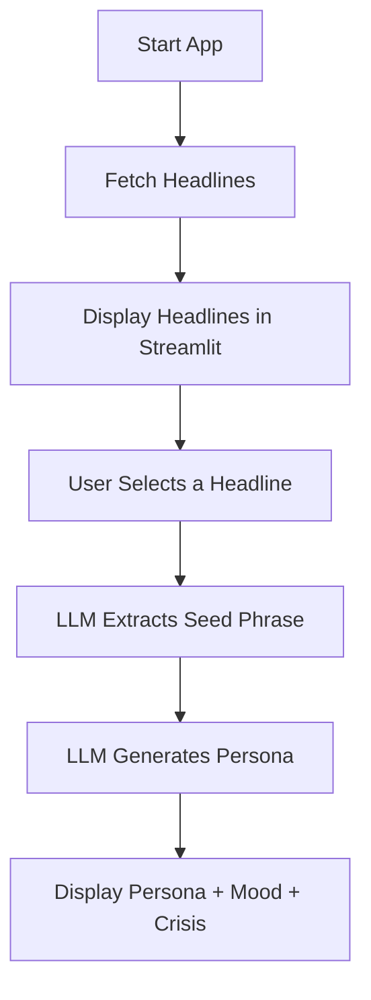

# vibereader

**vibereader** is a poetic AI prototype that simulates a fictional persona encountering global news. The app automatically fetches recent headlines from reputable sources, allows a user or agent to select one emotionally compelling headline, extracts a metaphorically rich phrase from the article, and then simulates a fictional persona reacting to the news with a unique role, mood, and personal crisis. The project is built using Streamlit for the frontend and the OpenAI Agent SDK for orchestration.

It demonstrates:
- Headline harvesting from RSS feeds (e.g., The Guardian)
- LLM-based phrase extraction
- Persona simulation based on mood, role, and fictional crisis
- Streamlit app to display results

The ultimate goal is to serve as a creative writing or narrative seed generator.

## 🧠 Flowchart

## about the personas

7 roles × 7 moods × 7 crises × 7 alignments × 7 motivations × 7 attachment styles × 7 worldviews
= 823,543 possible persona combinations